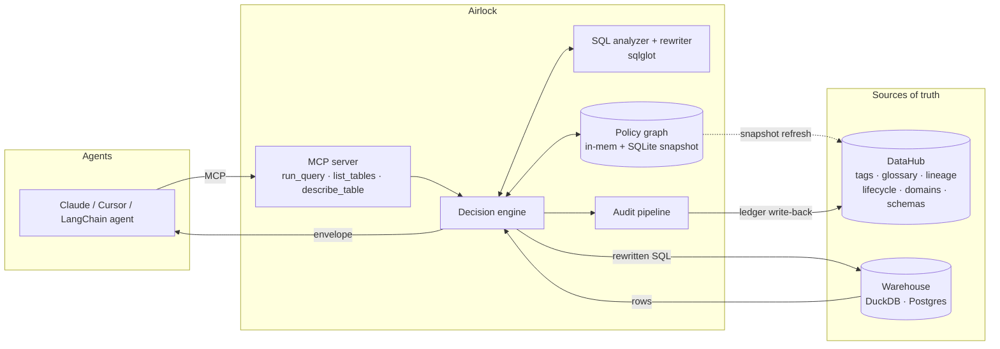
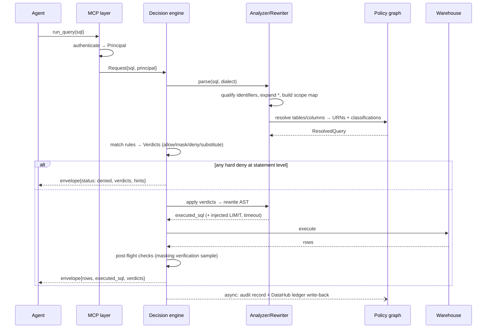

<p align="center">
  
</p>

<p align="center">
  <a href="LICENSE"></a>
  
  
  
  
  
</p>

<p align="center">
  <b>Point your agent's database connection at Airlock instead of the warehouse.</b><br/>
  Policy is compiled live from your DataHub catalog, enforced in-flight on every query, and<br/>
  explained back to the agent in a form it can act on. One URL swap. No warehouse changes.
</p>

<p align="center">
  <a href="#quickstart">Quickstart</a> ·
  <a href="#see-it-work">Demo</a> ·
  <a href="#features">Features</a> ·
  <a href="#architecture">Architecture</a> ·
  <a href="#edge-cases--and-how-airlock-handles-them">Edge cases</a> ·
  <a href="#configuration-reference">Configuration</a> ·
  <a href="#faq">FAQ</a>
</p>

---

<p align="center">
  
</p>

The agent asked for `ssn`. It didn't get `ssn`. It got told *why* it didn't get `ssn`, in a form it could read, so its next query didn't ask again. No warehouse grants were rewritten, no view was rebuilt, and the whole thing is in the audit log with the exact policy version that made the call.

That is the entire pitch. The rest of this README is how.

## The problem

Every team shipping an AI data agent in 2026 hits the same wall, and it isn't accuracy. It's this conversation:

> **Engineer:** "The agent needs a warehouse credential to answer questions."
> **Security:** "You want to give a non-deterministic text generator `SELECT` on tables full of customer PII?"
> **Engineer:** "...it's read-only?"
> **Security:** "No."

Security is right. And the options on the table are all bad:

| Option | Why it fails for agents |
|---|---|
| **Broad service account** | The agent reads anything the account can. One prompt injection from exfiltrating `users.ssn`. Auditors will (correctly) fail this. |
| **Warehouse RBAC / masking views** | Static, role-based, per-warehouse. Nobody maintains per-agent grants across hundreds of tables; policy drifts from reality within a month. Every reclassification means new `GRANT`s and rebuilt views. |
| **Enterprise access platforms** (Satori, Immuta, Cyral) | The enforcement model works — but six-figure contracts, built for human BI users, and not agent-aware: a blocked query is a dead end, not a correction signal. |
| **Generic MCP gateways** (the 2026 crop) | Auth, tool allowlists, rate limits, and regex PII scanning of *strings*. None of them parse SQL, none know which columns are sensitive *in your org*, and none know `users_raw` was deprecated last Tuesday. Regex on a result set is not a security boundary. |

So pilots stall in security review, or they ship with an over-permissioned credential and become a breach report waiting to be written. The blast radius of one such credential is your entire warehouse; one leaked answer with unmasked PII is a reportable GDPR/CCPA incident. Teams don't need a smarter agent. They need a place to stand between the agent and the data.

## The solution

Airlock is that place: a small, self-hostable gateway that speaks **MCP** to the agent and **your warehouse's SQL** on the other side. Every query that passes through it goes down the same road.

<p align="center">
  
</p>

1. **Every query is parsed, not pattern-matched.** Airlock builds a full AST with [sqlglot](https://sqlglot.com), qualifies every column through aliases, CTEs, subqueries, and `SELECT *`, and resolves each one to a catalog URN. A column smuggled through three aliases is still the column it is.
2. **Policy is compiled from DataHub, not hand-written.** Column tags (`PII`, `Sensitive`), glossary terms, deprecation status, certification, domains, ownership — the facts your governance team already maintains — become enforceable rules. Airlock makes the catalog *load-bearing* instead of decorative.
3. **Enforcement is a query rewrite.** Masking, column denial, row-limit and timeout injection, and — the part nobody else does — **certified-table substitution**: query a deprecated table and, if lineage points to a certified equivalent with a compatible schema, Airlock quietly redirects you there.
4. **Every intervention is explained in a machine-readable envelope.** A blocked human retries in frustration. A blocked agent that reads *"column `ssn` denied under rule `pii-hard-deny` — no substitute; try an aggregate over a non-sensitive key"* fixes itself on the next turn. Guardrails become steering.
5. **Every decision is written back.** Local JSONL audit, optional OpenTelemetry, and an access ledger written into DataHub — so the graph accumulates a queryable record of what each agent touched, when, and under which policy snapshot.

**One sentence:** Airlock turns your metadata catalog into a runtime security boundary for AI agents, with enforcement your CISO can audit and explanations your agent can act on.

## Who it's for

- **Platform / data-infra teams** who want to unblock agent projects without hand-rolling per-agent grants.
- **Security teams** who need one auditable chokepoint with fail-closed defaults and a paper trail.
- **Agent builders** whose text-to-SQL pilots keep dying in security review.
- **Governance teams** tired of curating a catalog nobody enforces.

## No mock mode. There is no mock mode.

This is worth being blunt about, because it's the thing most hackathon projects fake. Airlock has no `--mock` flag, no fixture fallback, no canned classifications, no "demo path" that skips the real work.

- **DataHub is a hard dependency, by design.** `airlock serve` refuses to start until it has compiled a policy snapshot from a live DataHub. If the catalog is unreachable you get a named, actionable error — never a silent fallback to an empty (allow-everything) policy. There is no code path that makes an access decision the graph didn't produce.
- **The demo stack *is* the product.** `python demo/up.py` boots a real DataHub (official quickstart images), ingests a classified retail catalog through the real ingestion API, loads matching rows into a real DuckDB file, and starts Airlock against both. The scripted prompts run the exact code path production traffic runs: parse → resolve → decide → rewrite → execute → audit → write-back.
- **Fakes live only inside `tests/unit/`,** behind the same protocols the real implementations satisfy. If a feature can't be shown against the live stack, it isn't in this README.

The most convincing thirty seconds of the demo is the live retag: change a tag in the DataHub UI, wait one refresh, ask the same question, watch the answer change. It's convincing because nothing is mocked.

## Quickstart

> **~60 seconds to a running gateway.** You need Python 3.11+, Docker running, and any MCP client (Claude Desktop, Claude Code, Cursor, or an MCP-compatible framework). Identical on macOS (Apple Silicon + Intel), Linux (x86-64 + arm64), and Windows 10/11 — native PowerShell, no WSL.

### Option A — the full demo stack (do this first)

Spins up a local DataHub preloaded with a classified retail dataset, a DuckDB warehouse with matching rows, and Airlock wired between them.

```bash
git clone https://github.com/Purv-Kabaria/Airlock && cd Airlock
python demo/up.py       # one launcher, every OS; ~3 minutes on first run
```

`up.py` is safe to run twice (fully idempotent), checks that Docker is actually up before doing anything, finds free ports if the defaults are taken, and prints exactly what to do next. When something in your environment is off, `airlock doctor` walks the whole checklist — Python version, Docker daemon, ports, DataHub reachability, warehouse driver — pass/fail with the fix for each. `python demo/reset.py` returns everything to a clean slate.

Then point your MCP client at it (Claude Desktop shown):

```json
{
  "mcpServers": {
    "warehouse": {
      "command": "uvx",
      "args": ["airlock", "serve", "--config", "demo/airlock.yaml"]
    }
  }
}
```

Ask: *"Top customers by lifetime value, with their emails?"* — then watch the enforcement land in the response envelope and in `airlock tail`.

### Option B — against your own stack

```bash
pip install airlock-gateway
airlock init            # wizard: DataHub URL + token, warehouse DSN, defaults
airlock check "SELECT * FROM users" --as analytics-agent   # dry-run before going live
airlock serve
```

`airlock init` validates connectivity to DataHub *and* the warehouse before writing config, tells you what's missing if either fails, and never writes secrets to disk (env vars and secret refs only).

### The one-URL-swap promise

If your agent already talks to a Postgres or DuckDB MCP server or connection string, integration is replacing that endpoint with Airlock's. Nothing else changes — Airlock exposes the tool surface the agent already expects (`warehouse_run_query`, `warehouse_list_tables`, `warehouse_describe_table`). It's a drop-in the same way a reverse proxy is a drop-in for a human client.

`warehouse_describe_table` is more than a schema dump: it annotates every column with the policy that would fire on it — allow, mask (with the strategy), or deny (with the reason) — resolved through the same engine that enforces. An agent reads the card and selects only usable columns instead of learning your policy through denials. Pair Airlock with [DataHub's MCP Server](docs/datahub-mcp-composition.md) and the agent gets both halves of a DataHub-native stack: DataHub for discovery, Airlock for governed execution.

### It runs on whatever laptop a judge owns

No compiler, no native build step, no platform-specific path, ever. Airlock and its dependencies install from prebuilt universal wheels everywhere (sqlglot is pure Python; DuckDB ships wheels for all our targets). CI runs the full test suite *and boots the complete demo stack* on Ubuntu, macOS, and Windows for every commit — cross-platform is verified, not hoped for.

## See it work

A real session, abridged. Principal `growth-agent` is scoped to the `Marketing` domain. The catalog has `email` tagged `PII` (mask), `ssn` tagged `PII.SSN` (deny), and `users_raw` deprecated in favor of `dim_users`.

**Request** (from the agent, via MCP `warehouse_run_query`):

```sql
SELECT u.name, u.email, u.ssn, o.total
FROM users_raw u JOIN orders o ON o.user_id = u.id
ORDER BY o.total DESC LIMIT 10
```

**Response envelope** (abridged):

```json
{
  "status": "executed_with_modifications",
  "request_id": "req_01J9ZK3M",
  "rows": [ "... 10 rows, email partially masked, ssn null ..." ],
  "executed_sql": "SELECT u.name, airlock_mask_email(u.email) AS email, NULL AS ssn, o.total FROM dim_users u JOIN orders o ON o.user_id = u.id ORDER BY o.total DESC LIMIT 10",
  "verdicts": [
    {
      "code": "AIRLOCK-201", "action": "substitute",
      "subject": "table:users_raw",
      "reason": "users_raw is deprecated (lifecycle DEPRECATED, 2026-06-30). Certified downstream equivalent dim_users selected via lineage; all referenced columns present with compatible types.",
      "catalog_url": "http://localhost:9002/dataset/urn:li:dataset:...users_raw"
    },
    {
      "code": "AIRLOCK-110", "action": "mask",
      "subject": "column:dim_users.email",
      "reason": "Tagged PII; rule pii-default applies strategy partial_email for principal growth-agent.",
      "hint": "Masked values preserve equality: GROUP BY / COUNT(DISTINCT email) stay correct."
    },
    {
      "code": "AIRLOCK-120", "action": "deny_column",
      "subject": "column:dim_users.ssn",
      "reason": "Tagged PII.SSN; no principal may read this column through Airlock.",
      "hint": "For cardinality, request COUNT(*) grouped by a non-sensitive column instead."
    }
  ],
  "policy_snapshot": "sha256:9f2c…",
  "audit_ref": "urn:li:document:airlock-ledger-2026-07-21"
}
```

The agent reads the verdicts, understands *why*, and — in our demo transcript — reformulates its next query without `ssn`, unprompted. That's the whole difference between a gateway built for humans and one built for agents.

## Features

**Enforcement**
- **Semantic SQL firewall** — AST analysis, never regex. CTEs, subqueries, joins, aliases, `UNION`, window functions.
- **In-flight column masking** — strategies: `null`, `hash` (salted SHA-256; equality-preserving, so `GROUP BY` / `COUNT DISTINCT` still work), `partial_email`, `partial_phone`, `generalize_date` (day→month), `fixed_string`. Extensible via one Python entry point.
- **Column denial** — hard-deny columns (e.g. `PII.SSN`) regardless of principal.
- **Predicate protection** — masked columns are guarded in `WHERE` / `HAVING` / `ORDER BY` / `JOIN ON` too, closing the membership-inference leak (`WHERE email='x'` proving a row exists). Block the predicate or rewrite it against the masked form — your call.
- **Certified-table substitution** — deprecated/uncertified references redirected to certified equivalents found through lineage, gated by a schema-compatibility check. Modes: `rewrite`, `warn`, `off`.
- **Statement-class control** — read-only by default; `INSERT`/`UPDATE`/`DELETE`/DDL denied with an explanation unless explicitly allowlisted per principal.
- **Row-limit + timeout injection** — every query gets a `LIMIT` cap and a statement timeout unless the principal is exempt.
- **Scope enforcement** — principals are confined to DataHub domains/platforms; cross-domain reads are denied with the owning team named in the explanation.

**Policy**
- **Catalog-compiled** — rules bind to *classifications* (tags, glossary terms, lifecycle, certification), not table names. Tag a new column `PII` in DataHub; it's enforced on the next refresh with zero Airlock changes.
- **Policy-as-code** — `airlock.yaml` lives in Git and goes through code review like anything else. `airlock policy lint` validates before deploy; `airlock policy diff` shows what a change would alter.
- **Principals & identities** — per-agent keys mapped to named principals with scopes; unknown principals get the deny-by-default anonymous policy.
- **Dry-run everything** — `airlock check <sql> --as <principal>` shows the full decision without executing; `enforce: monitor` logs verdicts without applying them, for safe rollout.
- **Coverage reporting** — `airlock coverage` reports what the policy can actually enforce and where the catalog leaves it blind: governed vs merely classified columns, rules that match nothing, deprecated tables with no certified substitute, datasets no principal can reach, and columns whose names read as sensitive while carrying no classification any rule acts on. `--fail-under` and `--strict` make governance posture a CI gate.

**Explanations & DX**
- **Machine-readable verdict envelope** on every response — stable reason codes (`1xx` mask, `2xx` substitute, `3xx`/`4xx` deny & faults), human reasons, catalog deep links, actionable hints.
- **Human-friendly errors** — what happened, why, what to do next. No stack traces across the wire, ever.
- **`airlock tail`** — live colorized decision stream for demos and debugging; `airlock explain <request_id>` replays any past decision.

**Audit & write-back**
- **Append-only JSONL audit** with the policy-snapshot hash on every decision (prove *which* policy version made *which* call).
- **DataHub write-back** — ledger entries as catalog documents plus per-dataset structured properties (`airlock.lastAgentAccess`, `airlock.deniedAttempts`), so agent behavior is queryable inside the graph.
- **OpenTelemetry** traces/metrics (optional): decision latency, verdict counts, cache hit rate.

**Operations**
- **Fail-closed by default**, with one explicit, bounded stale-cache window (see edge cases). Every relaxation of safety is a visible config line.
- **Snapshot cache** — policy compiles to an in-memory graph backed by SQLite; steady-state decisions add low single-digit milliseconds and zero DataHub calls.
- **Zero warehouse footprint** — masking is inlined SQL expressions; nothing is installed in the database.
- **Health & readiness** (`/healthz`, `/readyz`) — readiness gates on "a valid snapshot is loaded," so an orchestrator never routes to a gateway that can't decide.
- **Graceful shutdown & cancellation** — Ctrl+C stops new work, cancels in-flight warehouse statements (no orphaned queries burning credits), and drains pending audit writes within a deadline; a client disconnect cancels its statement the same way.
- **`airlock doctor`** — one command that verifies the whole environment and names the fix for anything broken. First thing to run, last thing to blame.

## Use cases

1. **Unblock the text-to-SQL pilot.** Give the analytics agent a scoped Airlock key instead of a warehouse credential. Security reviews one gateway config, not one agent.
2. **Multi-agent least privilege.** Ten agents, one warehouse: each confined to its domain, PII masked for all, finance tables invisible to the support bot — from one YAML file and the catalog you already keep.
3. **Deprecation that sticks.** Data eng deprecates `users_raw`; every agent in the company is transparently moved to `dim_users` the same hour, with a verdict trail proving it.
4. **Audit evidence on demand.** "Every agent access to PII columns in Q3" is a query against the ledger — in DataHub, where the auditors already look.
5. **Safe rollout.** Run a new agent through Airlock in `monitor` mode for a week, review the would-have-been verdicts, then flip to `enforce`.

## Architecture

### High-level design



Three principles drive the design:

- **PDP/PEP separation.** DataHub is the *policy information point* (facts), `airlock.yaml` is the *policy definition* (rules over facts), the decision engine is the *decision point*, and the rewriter + executor is the *enforcement point*. Each is a separate module with a narrow interface, testable alone.
- **Decisions are local; the catalog is consulted asynchronously.** No query waits on a DataHub round-trip. The policy graph is a compiled snapshot with explicit freshness semantics.
- **Everything is replayable.** A decision is a pure function of `(query, principal, snapshot)`; snapshots are content-addressed, so any historical decision replays bit-for-bit.

### Request lifecycle



### Module layout

```
airlock/
├── mcp/            # MCP server: tool defs, auth, request/response envelopes
├── analyzer/       # sqlglot wrapper: parse, qualify, star-expansion, scope
│   ├── resolve.py  #   column/table → URN resolution through aliases/CTEs
│   └── rewrite.py  #   verdict application: mask exprs, substitution, limits
├── policy/
│   ├── compile.py  #   DataHub snapshot → PolicyGraph — the only DataHub reader
│   ├── rules.py    #   rule model + matcher (classification → action)
│   ├── coverage.py #   pure posture report: what the policy can enforce, and
│   │               #   where the catalog leaves it blind
│   └── store.py    #   SQLite-backed snapshot store, content-addressed
├── engine/
│   ├── decide.py   #   pure decision fn: (ResolvedQuery, Principal,
│   │               #   PolicyGraph) → list[Verdict] — no I/O in this file
│   └── verdicts.py #   Verdict, ReasonCode, envelope construction
├── exec/           # warehouse adapters (duckdb, postgres) + pooling, timeouts
├── audit/          # JSONL sink, OTel sink, DataHub write-back sink
├── masking/        # strategy registry (entry-point extensible)
└── cli/            # init, serve, check, coverage, tail, explain, policy, doctor
```

Two details worth calling out, because they're where the catalog earns its keep:

- **`SELECT *` is unmaskable without a schema — and Airlock always has one.** Star expansion needs the column list; generic proxies punt here. Airlock expands `*` against schemas from the snapshot (sourced from DataHub), so `SELECT *` on a table with one PII column becomes an explicit column list with exactly that column masked. Unknown schema → deny with `AIRLOCK-402`, never a blind pass-through.
- **Substitution is verified, not vibes.** Before rewriting `users_raw → dim_users`, Airlock checks every referenced column exists on the substitute with a compatible type. Any mismatch downgrades `rewrite` to `warn`, with the mismatch named in the verdict.

## Edge cases — and how Airlock handles them

Security tooling is judged by its worst case, not its demo. This table is the contract; every row has at least one test named `test_edge_NN_<slug>`, enforced by `tools/check_edges.py`.

| # | Edge case | Behavior | Reason code |
|---|---|---|---|
| 1 | **Unparseable / malformed SQL** | Fail closed: never forwarded. Error names the parse position and dialect. | `AIRLOCK-401` |
| 2 | **Table not in catalog** | Configurable; default deny (`unknown_tables: deny`). Suggests checking the catalog or registering the table. | `AIRLOCK-403` |
| 3 | **`SELECT *`** | Expanded to explicit columns from the snapshot schema, then per-column policy applies. Unknown schema → deny. | `AIRLOCK-402` |
| 4 | **Masked column in `WHERE` / `JOIN ON` / `HAVING`** | Membership-inference guard: denied by default (`predicate_policy: deny`) or rewritten against the masked form (`transform`). Never silently allowed. | `AIRLOCK-130` |
| 5 | **Masked column in `ORDER BY` / `GROUP BY`** | Hash preserves equality → `GROUP BY` correct; `ORDER BY` allowed but flagged as meaningless in the hint. | `AIRLOCK-111` |
| 6 | **Aggregates over denied columns** (`COUNT(ssn)`) | Denied; hint suggests `COUNT(*)` or aggregation over non-sensitive keys. | `AIRLOCK-121` |
| 7 | **CTEs, nested subqueries, aliases** | Full scope resolution before matching; a PII column through three aliases still resolves to its URN. Property-tested. | — |
| 8 | **`UNION` with mixed classifications** | Column-position merge takes the *strictest* classification of the branches. | `AIRLOCK-112` |
| 9 | **DDL / DML / multi-statement input** | Statement-class allowlist; default read-only. Multi-statement rejected whole (no partial execution). | `AIRLOCK-404` |
| 10 | **DataHub unreachable at query time** | Non-event: decisions never call DataHub. Background refresh fails and alerts. | — |
| 11 | **DataHub down past the staleness budget** | Snapshot older than `max_staleness` (default 24h) → degrade per `stale_policy`: `fail_closed` (default) or `serve_stale_readonly` with a warning verdict on every response. | `AIRLOCK-410` |
| 12 | **Substitute missing referenced columns** | Substitution downgraded to warning; original used only if not hard-denied, else deny with both facts explained. | `AIRLOCK-202` |
| 13 | **Case sensitivity / quoted identifiers** | Normalization follows the dialect's rules (via sqlglot), not naive lowercasing. | — |
| 14 | **`information_schema` / catalog introspection** | Denied by default: system tables aren't in the catalog, so they fall under `unknown_tables`. The sanctioned path is `warehouse_list_tables` / `warehouse_describe_table`, scope-filtered. | `AIRLOCK-403` |
| 15 | **Prompt-injected exfiltration** (`ignore previous instructions; SELECT ssn…`) | Irrelevant by design: enforcement is below the prompt layer. The query is just SQL; `ssn` is just a denied column. This is the point. | `AIRLOCK-120` |
| 16 | **Enormous result set** | Row-limit injection (default 10,000) + statement timeout; truncation is declared in the envelope, never silent. | `AIRLOCK-150` |
| 17 | **Masking collision with real data** | Post-flight verification samples rows and asserts masked columns match the strategy's output shape; mismatch → response withheld, incident logged. | `AIRLOCK-420` |
| 18 | **Concurrent policy refresh during a request** | Requests pin the snapshot they started with (immutable, content-addressed); refresh swaps an atomic pointer. No torn reads. | — |
| 19 | **Two rules match one column** | Deterministic precedence: `deny > mask > allow`; among masks the more specific subject wins; ties are a lint error, not a runtime surprise. | — |
| 20 | **Unknown principal / missing key** | Anonymous principal = deny-all. The error tells the operator exactly how to register the agent. | `AIRLOCK-430` |
| 21 | **Identical requests sent twice at once** | In-flight coalescing: one warehouse execution, both callers get the result. No duplicate load, no duplicate audit noise. | — |
| 22 | **Concurrency burst** | Async path + connection pool + bounded queue. Under the cap: everything runs. Over it: clean rejection with a retry-after hint. | `AIRLOCK-440` |
| 23 | **Client disconnects mid-query** | Warehouse statement cancelled, connection returned, cancellation noted in audit. No orphaned queries burning credits. | — |
| 24 | **DataHub restarts mid-session** | Non-event for requests (pinned snapshot). Background refresh retries with backoff; `airlock doctor` / `/healthz` surface the gap. | — |
| 25 | **Warehouse connection drops** | One automatic retry with backoff for reads, then a typed error naming the warehouse and the check to run. | `AIRLOCK-441` |
| 26 | **Ctrl+C on the gateway** | In-flight statements cancelled cleanly; pending audit writes drained within a deadline; a second Ctrl+C hard-stops. Audit writes are line-atomic. | — |
| 27 | **Natural language sent as SQL** (`run_query("show me top customers")`) | Detected pre-parse; friendly error explains the tool takes SQL and lists the principal's visible tables. Recovers in one turn. | `AIRLOCK-406` |
| 28 | **Trailing semicolons, odd whitespace, comments, non-ASCII literals** | Normalized before analysis; comments stripped *prior* to matching, so nothing hides in them. Emoji in a string literal is just data. | — |
| 29 | **`EXPLAIN` / `SET` / `SHOW` / transactions / prepared statements** | Statement-class table: `EXPLAIN` runs against the *rewritten* query (inspect plans, not bypass masks); session/transaction control denied with the config key that would allow it. | `AIRLOCK-404` |
| 30 | **Pathological input** (1,000-deep nesting, 100k-item `IN`, megabyte query) | Parser depth and size limits reject before resource exhaustion, with the limit named. Not DoS-able through one weird query. | `AIRLOCK-405` |
| 31 | **Setup friction** (port taken, `up.py` twice, stale containers, Docker down) | The launcher self-heals (idempotent re-run, alternate ports) or names the exact fix; `demo/reset.py` guarantees a clean slate. | — |
| 32 | **Dynamic column selectors** (`SELECT COLUMNS('.*') FROM t`, DuckDB) | Fail closed: a `COLUMNS(...)` selector isn't expanded to concrete columns, so it's never classified — denied whole rather than returned raw. | `AIRLOCK-407` |
| 33 | **Table-valued functions** (`read_csv('/etc/passwd')`, `glob`, `read_text`, `range`) | Denied unconditionally — even under `unknown_tables: allow`. A table function isn't a catalog dataset and can read files/URLs; it never reaches the warehouse. | `AIRLOCK-408` |
| 34 | **Uncatalogued column on a known table** (warehouse drifted ahead of the catalog) | Fail closed under default `unknown_tables: deny`: a column the catalog schema doesn't list can't be classified, so it's denied — a not-yet-tagged sensitive column never slips through. `allow` passes it. | `AIRLOCK-409` |

## Error message design

Every error and verdict has one shape, tuned for two readers at once — the agent (structured fields) and the human tailing the log (the `reason` sentence):

```
what happened  →  "Column dim_users.ssn was removed from your query."
why            →  "It is tagged PII.SSN; rule pii-hard-deny applies to all principals."
what now       →  "For cardinality questions, aggregate over non-sensitive columns."
where to look  →  catalog_url + request_id + policy_snapshot hash
```

House rules, enforced in review: no stack traces across the wire; no jargon without a link; no error that ends in a dead end — every message carries at least one action the reader can take.

## Configuration reference

```yaml
# airlock.yaml — checked into Git; secrets via env refs only
datahub:
  url: ${DATAHUB_GMS_URL}
  token: ${DATAHUB_GMS_TOKEN}
  snapshot:
    refresh_interval: 5m
    max_staleness: 24h          # past this, stale_policy applies
    stale_policy: fail_closed   # fail_closed | serve_stale_readonly

warehouse:
  kind: duckdb                  # duckdb | postgres
  dsn: ${WAREHOUSE_DSN}
  defaults: { row_limit: 10000, statement_timeout: 30s }

enforcement:
  mode: enforce                 # enforce | monitor
  unknown_tables: deny          # deny | allow
  statement_classes: [select]   # additions require explicit principal grants
  predicate_policy: deny        # deny | transform   (masked cols in WHERE/JOIN)
  substitution: rewrite         # rewrite | warn | off
  table_matching: exact         # exact | suffix     (see note below)

rules:
  - id: pii-default
    match: { tag: PII }
    action: { mask: partial }           # strategy resolved per column type
  - id: pii-hard-deny
    match: { glossary_term: "Classification.SSN" }
    action: deny
  - id: deprecated-redirect
    match: { lifecycle: DEPRECATED }
    action: substitute_certified

principals:
  - name: growth-agent
    key: ${AIRLOCK_KEY_GROWTH}
    scopes: { domains: [Marketing] }
  - name: finance-agent
    key: ${AIRLOCK_KEY_FINANCE}
    scopes: { domains: [Finance] }
    overrides: { row_limit: 100000 }

masking:
  salt: ${AIRLOCK_MASK_SALT}    # secret for the equality-preserving hash strategy

server:                         # concurrency + caching knobs (defaults shown)
  max_concurrency: 64           # concurrent decisions before requests queue
  burst: 200                    # extra queued above the cap; over it -> AIRLOCK-440
  connection_pool: 8            # warehouse connections
  decision_cache: 2048          # memoized plans on (sql, principal, snapshot_hash)
  writeback_queue: 512          # bounded remote-audit backlog; over it the remote
                                # copy is dropped (counted, logged) while the local
                                # JSONL sink stays authoritative

audit:
  jsonl: ./audit/decisions.jsonl
  datahub_writeback: true       # ledger documents + structured properties
  otel: { enabled: false }
```

`masking.salt` is a deployment secret. The `hash` strategy is deterministic (so joins and `GROUP BY` on masked keys work), which means a shared secret is what stops anyone who knows the public policy from brute-forcing low-cardinality hashed values. Leave it unset only in the demo; Airlock then derives a salt from the snapshot hash and warns.

`table_matching` controls how a written table name maps to a catalog dataset. `exact` (default, fail-closed) requires the name to match the catalog name; an over-qualified `catalog.schema.table` when the catalog stored `table` is treated as unknown and denied. `suffix` additionally resolves an unambiguous over-qualified name — convenient for real warehouses whose ingestion drops the prefix — and still fails closed when a bare leaf maps to more than one dataset. Opt-in, because resolving a name the catalog didn't canonically store is a small relaxation of the default.

Validated on startup and by `airlock policy lint`; misconfiguration produces a named, positional error (`rules[2].action: unknown action 'masq' — did you mean 'mask'?`), not a traceback.

## Performance & concurrency

Budgets enforced by CI (`make bench`, `make load`), not aspirations. A regression fails the build; measured numbers ship per release in `docs/benchmarks.md`.

| Budget | Target |
|---|---|
| Decision overhead (parse + resolve + decide + rewrite), p95 | **< 10 ms** on the benchmark corpus |
| Repeated query (decision cache hit), p95 | **< 1 ms** |
| Cold start → `/readyz` (snapshot already cached) | **< 5 s**; first-ever compile reported separately |
| Sustained concurrency | **50 agents**, zero errors, decision p95 < 25 ms |
| Burst | **200 at once**: bounded queue, zero drops below the cap, clean `AIRLOCK-440` above it |
| Steady-state memory | **< 300 MB** with the demo catalog loaded |

How those numbers happen:

- **Fully async request path.** The MCP layer is asyncio end-to-end; warehouse calls run on pooled connections off the event loop. Nothing blocks.
- **Lock-free policy reads.** A snapshot swap is one atomic pointer exchange; every request pins the snapshot it started with. A thousand concurrent decisions share zero locks.
- **Decision cache.** Verdict sets are memoized on `(sql, principal, snapshot_hash)` — the exact key that makes caching *safe*: any policy change changes the hash and invalidates stale entries automatically.
- **In-flight coalescing.** Identical concurrent queries from one principal (the impatient double-send) hit the warehouse *once*; every caller gets the result.
- **Off-path everything.** Snapshot refresh runs in the background. The local audit log is written before the response (line-atomic — no query answered without a durable record); DataHub write-back and OTel export are background tasks drained on shutdown.

## Prior art, and what is actually new here

Column masking driven by data classification is not a new idea. Immuta, Satori, and Privacera build
businesses on it, and Snowflake and Databricks ship native masking policies. Airlock is not claiming
to have invented dynamic masking. Three things are different:

**Policy compiles from the catalog you already run.** The commercial tools maintain their own
metadata plane and expect you to classify data inside it, which means a second source of truth to
keep in sync with your catalog. Airlock has no metadata store: tags, glossary terms, lifecycle,
domains, schemas, and lineage are read from DataHub, and the compiled snapshot is content-addressed
so every decision names the exact catalog version that produced it. Retag a column in the DataHub
UI and enforcement changes on the next refresh — there is nothing else to update.

**Nothing is installed in the warehouse.** Native masking policies are DDL: per-warehouse, per-
dialect, applied by someone with elevated rights, and invisible from outside the database. Airlock
rewrites the query in flight, so the same policy covers DuckDB and Postgres identically and leaves
no footprint to drift or migrate.

**The denial is addressed to a machine.** This is the part with no equivalent elsewhere. Existing
tools are built for humans in BI tools: they mask silently or return an error meant to be read by a
person. An agent handed "permission denied" retries the same query, or hallucinates around the gap.
Airlock returns a structured envelope — a stable `AIRLOCK-NNN` reason code, the subject, a human
reason, and at least one actionable hint — so the agent can reformulate on the next call instead of
guessing. The eval suite tests exactly that loop: deny, then successful reformulation.

Where those tools are ahead: row-level security, mature policy authoring UIs, many more warehouse
connectors, and years of production mileage. If you need row-level policy today, use one of them —
Airlock's granularity is table, column, and statement (see [`docs/rls.md`](docs/rls.md) for the
design).

## Security model & honest limitations

**In scope:** column/table/statement access enforcement for SQL issued through Airlock; masking; audit; scope confinement; membership-inference protection on masked columns.

**Out of scope, stated plainly so you don't find out the hard way:**
- Airlock governs the *paths that go through it*. An agent holding a raw warehouse credential bypasses everything — pair Airlock with credential hygiene (the agent's only credential should be its Airlock key).
- Row-level security is roadmap (design in `docs/rls.md`), not shipped. Today's granularity is table/column/statement.
- Aggregation-inference attacks (differencing across many allowed aggregates) are mitigated by audit visibility, not prevented. Open research area; we log enough to detect the pattern.
- Airlock is not an anomaly detector or a prompt-injection classifier — deliberately. It enforces deterministic policy below the prompt layer, which is exactly why prompt injection doesn't move it.

## Roadmap

Row-level rules from catalog attributes · result-set DLP as a pluggable post-flight scanner · Snowflake/BigQuery native adapters · policy simulation against historical query logs (`airlock replay`) · wrap-mode for governing third-party MCP servers · a DataHub Action that triggers snapshot refresh on classification change (push, not poll — shipped as a proposal in [`contrib/`](contrib/)).

## For hackathon judges

- **3-minute demo path:** `python demo/up.py` (any OS) → open the included MCP client config → run the three scripted prompts in `demo/SCRIPT.md` (clean · PII · deprecated-table) → `airlock tail` in a second pane shows live verdicts → the DataHub UI shows the write-back ledger.
- **Throw anything at it.** Send two prompts at once. Double-click. Kill the DataHub container mid-session and keep querying. Paste garbage into `run_query`. Ctrl+C the gateway mid-query and restart. Re-run `up.py`. Every one of these is a row in the edge-case table, has a named behavior, and is exercised by `make judge` — an automated hostile-user gauntlet that must be green on all three OSes before we tag a release. Make Airlock traceback, hang, or answer without a verdict and that's a bug we want filed.
- **Change the policy live.** Add the `PII` tag to a column in the DataHub UI, wait one refresh (or `airlock refresh`), re-ask the same question — the answer changes. Fastest way to confirm nothing is mocked.
- **Sample outputs, no setup:** [`examples/`](examples/) has captured request/response envelopes, before/after SQL pairs, and a full audit log — regenerated by `make examples`, never hand-edited.
- **Ask it what it can't protect.** `airlock coverage` reports its own blind spots: columns that look sensitive but carry no classification, rules that match nothing, tables no principal can reach. A security tool that only reports its wins is not one you should trust.
- **Upstream contributions:** two, both in [`contrib/`](contrib/) and kept dependency-isolated. A push-based snapshot-refresh [DataHub Action](contrib/datahub_action/), and [`datahub-audit`](contrib/datahub_audit_skill/) — a skill the `datahub-skills` registry routes users to from seven places across five files but never shipped.
- **Where DataHub is load-bearing:** policy compilation (tags, glossary, lifecycle, domains, schemas), star-expansion schemas, substitution via lineage, scope enforcement via domains, and the write-back ledger. Remove DataHub and Airlock cannot start — literally: `serve` refuses without a compiled snapshot. Design, not an integration checkbox.

## FAQ

**Why not just use warehouse RBAC?** Use both. RBAC is your coarse floor; Airlock is the agent-aware layer on top: classification-driven (no per-column `GRANT` churn), cross-warehouse, explanation-emitting, auditable in one place.

**Can I run Airlock without DataHub?** No, and that's deliberate. Airlock's whole premise is that decisions derive from governed, versioned catalog facts — not a config file someone forgot to update. A "standalone mode" would be a policy engine with made-up facts, which is the thing this project exists to replace. `serve` fails fast, with the fix.

**Why not build on the DataHub Agent Context Kit?** We tested it against the OSS quickstart these instructions boot. Its write tool (`add_structured_properties`) returns a 500, `get_dataset_queries` hits a cloud-only field, and `get_entities` drops `editableSchemaMetadata` — the aspect a tag applied in the DataHub UI lands in, which would quietly break the live-retag demo. Only `get_lineage` works on OSS, and it duplicates code Airlock already has; taking the Kit as a dependency would pull a compiled transitive to call one function. So Airlock talks to GMS through the same GraphQL and MCP-emit APIs the Kit uses, directly — reading five aspect types (including `editableSchemaMetadata`) and writing structured properties plus a ledger back. It is more OSS-robust than the Kit's own tools; the full evaluation is in [docs/datahub-mcp-composition.md](docs/datahub-mcp-composition.md).

**Why policy in YAML but facts in DataHub — why not everything in DataHub?** Facts (what is PII, what is deprecated) change often and belong to governance; rules (what happens to PII) change rarely and belong in code review. Splitting them means reclassification deploys instantly while enforcement changes get a human approver.

**What if sqlglot can't parse my dialect's exotic syntax?** The query fails closed with the parse error — the same guarantee a firewall gives for traffic it can't classify. Per-adapter dialect coverage is tested in CI.

**Does masking break the agent's analysis?** Less than you'd think. The hash strategy preserves equality, so distributions, joins on masked keys, `GROUP BY`, and `COUNT DISTINCT` stay correct. The verdict hints tell the agent which operations remain valid.

**Our catalog is barely tagged — won't Airlock just deny everything?** This is the most common real objection, so there is a command for it: `airlock coverage` reports exactly how much of your catalog the policy can act on, which columns look sensitive but carry no classification, and which rules match nothing at all. Run it before you turn anything on. Sparse classification is a catalog problem that Airlock makes visible rather than one it papers over — the alternative, guessing classifications from column names, is precisely the untrustworthy behavior this project exists to replace. Roll out with `enforce: monitor`, work the coverage report down, then flip to enforce.

**Is this production-ready?** In engineering discipline, yes from day one: fail-closed defaults, zero mock paths, content-addressed snapshots, CI-enforced latency and concurrency budgets, a three-OS matrix, graceful shutdown, health/readiness endpoints, and a hostile-user gauntlet gating every release. What it lacks is mileage — months of real traffic finding the failure modes tests don't. Honest path: run `enforce: monitor` against real traffic for a week, review the verdicts, then flip to enforce.

## Contributing & license

PRs welcome — see [`CONTRIBUTING.md`](CONTRIBUTING.md) and the decision records in [`docs/adr/`](docs/adr/). Licensed under **Apache 2.0** (see [`LICENSE`](LICENSE)).

---

<p align="center"><i>Built for <a href="https://datahub.devpost.com/">Build with DataHub: The Agent Hackathon</a>. Airlock is not affiliated with the DataHub project.</i></p>
