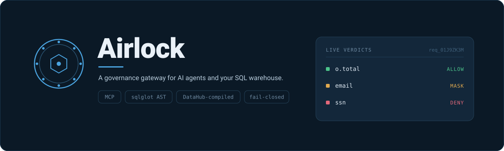
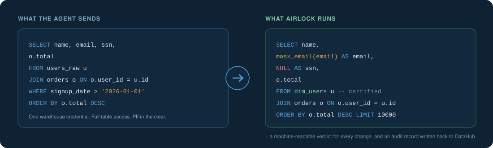
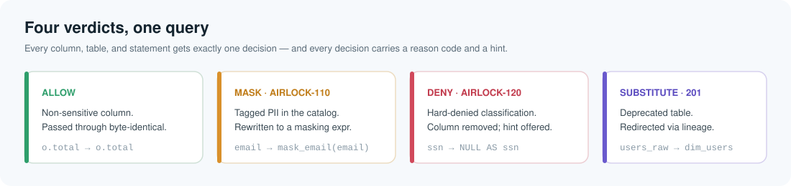
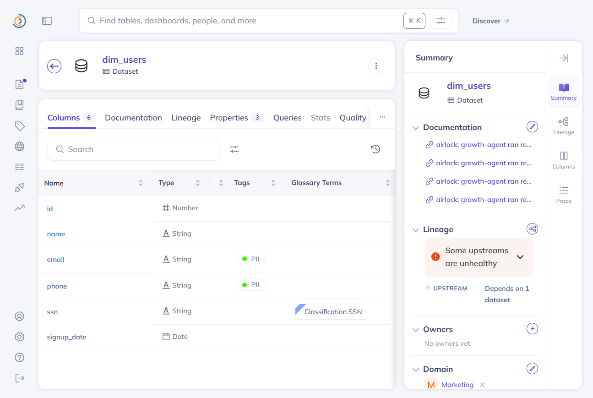
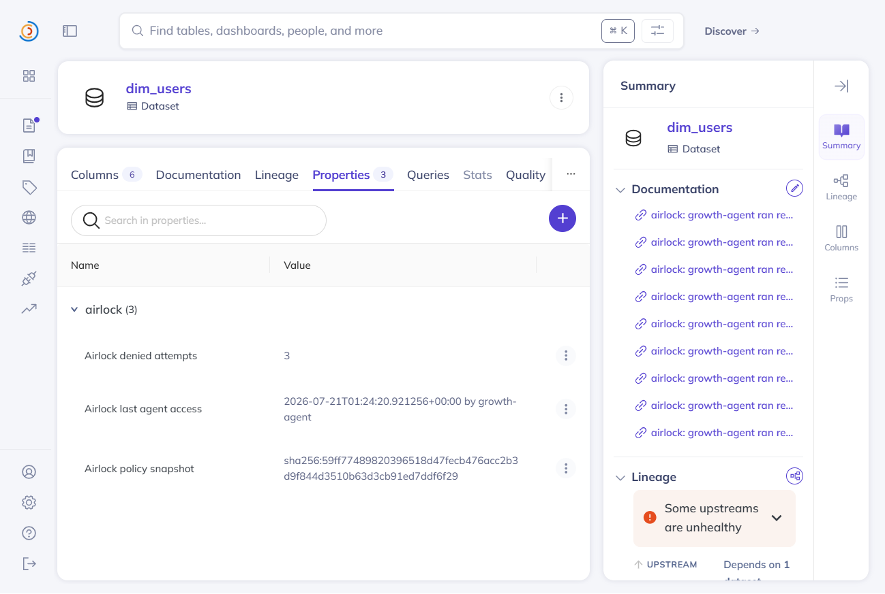
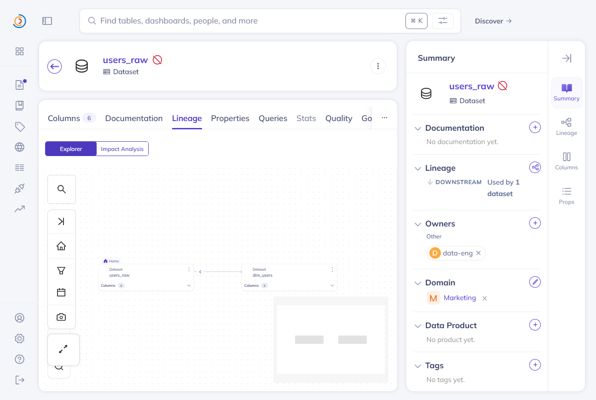
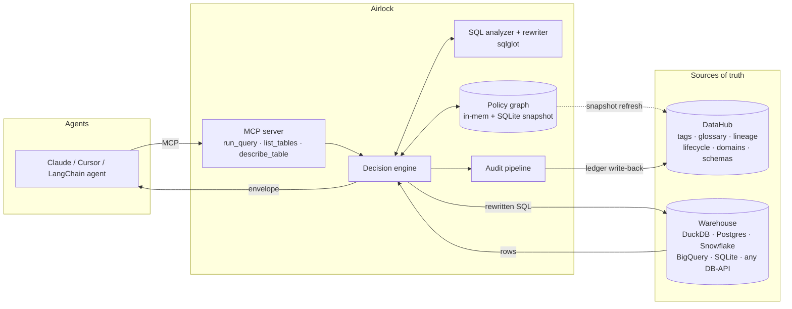
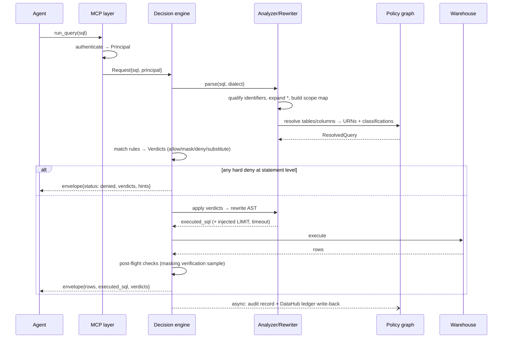

<p align="center">
  
</p>

<p align="center">
  <a href="LICENSE"></a>
  
  
  
  
  
</p>

<p align="center">
  <b>Let an AI assistant use your database without handing over everyone's private data.</b><br/>
  Point the agent at Airlock instead of the warehouse. It reads your DataHub catalog to decide<br/>
  what each agent may see, hides the rest as the query runs, and tells the agent why.<br/>
  One URL change. Nothing installed in your database.
</p>

<p align="center">
  <a href="#the-problem">The problem</a> ·
  <a href="#where-the-rules-come-from">How DataHub is used</a> ·
  <a href="#what-it-works-with">What it works with</a> ·
  <a href="#quickstart">Quickstart</a> ·
  <a href="#see-it-work">See it work</a> ·
  <a href="#architecture">Architecture</a> ·
  <a href="#configuration-reference">Configuration</a> ·
  <a href="#faq">FAQ</a>
</p>

---

<p align="center">
  
</p>

The agent asked for social security numbers and didn't get them. It was told *why*, in words a program can act on, so its next question didn't ask again. Nobody changed a database permission or rebuilt a view, and the decision is in the audit log next to the exact catalog version behind it.

## The problem

Every team shipping an AI data agent in 2026 hits the same wall, and it isn't accuracy. It's this conversation:

> **Engineer:** "The agent needs a warehouse credential to answer questions."
> **Security:** "You want to give a non-deterministic text generator `SELECT` on tables full of customer PII?"
> **Engineer:** "...it's read-only?"
> **Security:** "No."

Security is right. And the options on the table are all bad:

| Option | Why it fails for agents |
|---|---|
| **Broad service account** | The agent reads anything the account can. One prompt injection from exfiltrating `users.ssn`. Auditors will (correctly) fail this. |
| **Warehouse RBAC / masking views** | Static, role-based, per-warehouse. Nobody maintains per-agent grants across hundreds of tables; policy drifts from reality within a month. Every reclassification means new `GRANT`s and rebuilt views. |
| **Enterprise access platforms** (Satori, Immuta, Cyral) | The enforcement model genuinely works. But they are sold through enterprise procurement (none publish list pricing), they were built for human BI users, and none of them are agent-aware: a blocked query is a dead end, not a correction signal. |
| **Generic MCP gateways** (the 2026 crop) | Auth, tool allowlists, rate limits, and regex PII scanning of *strings*. None of them parse SQL, none know which columns are sensitive *in your org*, and none know `users_raw` was deprecated last Tuesday. Regex on a result set is not a security boundary. |

So pilots stall in security review, or they ship with an over-permissioned credential that becomes the next breach report. The blast radius of one such credential is your entire warehouse; one leaked answer with unmasked PII is a reportable GDPR/CCPA incident. Teams don't need a smarter agent. They need a place to stand between the agent and the data.

## The solution

Airlock is that place: a small gateway you run yourself. The agent talks to it the way it would talk to any tool; it talks to your database in that database's own SQL. Every question takes the same five steps.

<p align="center">
  
</p>

1. **It reads the query properly.** Not a search for scary words — Airlock parses the SQL with [sqlglot](https://sqlglot.com) and works out which real column every name refers to, through nicknames, sub-queries, and `SELECT *`. A column renamed three times is still the same column.
2. **It looks up the rules in DataHub.** Which columns are private, which table replaced which, who owns what, which agent is allowed where. Your governance team already keeps these notes; Airlock is what finally makes them do something.
3. **It rewrites the query before it runs.** Private columns come back covered up or empty, a retired table is swapped for its replacement, and a row limit and time limit are added so nothing runs away.
4. **It explains itself in a format a program can read.** A person who reads "permission denied" gives up. An agent that reads *"ssn is off limits to everyone — count a non-sensitive column instead"* asks a better question. Guardrails become directions.
5. **It records what happened.** A local audit log, and a write-back into DataHub, so the catalog builds up a record of which agent read what, when, and under which version of the rules.

**In one sentence:** your data catalog stops being documentation and starts being the thing that decides what an agent can see.

## Where the rules come from

Nothing in Airlock says "hide the email column." That decision already exists in DataHub, made by whoever owns the data — Airlock just reads it and enforces it.

**1. Someone marks the columns.** `email` and `phone` are tagged `PII`. `ssn` carries the glossary term `Classification.SSN`. This is ordinary catalog work a governance team already does.

<p align="center">
  
</p>

**2. Airlock reads it and acts.** Those tags are why `email` came back hidden and `ssn` came back empty in the example above. Change the tag, and the next query behaves differently — no code change, no restart, no redeploy. That is the whole idea, and it is the thirty seconds of the demo worth watching.

**3. And it writes back.** Every decision updates the dataset in DataHub: which agent read it last, the exact policy version behind the decision, and a running count of refusals. The data team sees agent activity in the tool they already use.

<p align="center">
  
</p>

DataHub is also how substitution works. `users_raw` is marked deprecated, and its lineage points at the certified replacement — so when an agent queries the old table, Airlock follows that edge and quietly runs the question against `dim_users` instead.

<p align="center">
  
</p>

| What Airlock reads from DataHub | What it does with it |
|---|---|
| Column tags (`PII`, `Sensitive`) | Decides which columns to hide |
| Glossary terms (`Classification.SSN`) | Decides which columns to refuse outright |
| Deprecation + certification | Redirects a retired table to its replacement |
| Column-level lineage | Protects an unlabelled column that was copied from a sensitive one |
| Domains + ownership | Keeps each agent inside its own area, and names who to ask for access |
| Schemas | Expands `SELECT *` safely, and catches columns the catalog has never seen |

| What Airlock writes back to DataHub | Where it shows up |
|---|---|
| Last agent access, policy version, refusal count | Structured properties on the dataset |
| A per-query access record | The dataset's documentation links |
| Read counts per agent and per column | The dataset's Stats tab |
| Suggested classifications for unlabelled columns | Proposals, via `airlock propose` |

## What it works with

Airlock sits between two things it doesn't want to be picky about: the agent and the database. It speaks [MCP](https://modelcontextprotocol.io) on one side, so any MCP client works, and it rewrites SQL on the other, so the same rules render correctly in each database's own dialect — nothing is installed in your warehouse either way.

| Databases | How |
|---|---|
| DuckDB, Postgres | Dedicated adapters, each exercised end to end against a live server — Postgres by `pytest tests/integration` against a throwaway container |
| Snowflake, BigQuery | Dedicated adapters, checked call-by-call against the installed driver (that audit found and fixed a broken Snowflake cancel). Still never run against a real account — treat them as untried on live data |
| SQLite | Ships with Python — no driver to install, runs on a Raspberry Pi |
| MySQL, Trino, ClickHouse, Redshift, Oracle, ODBC, … | `kind: dbapi` — name any [PEP 249](https://peps.python.org/pep-0249/) driver and its SQL dialect |

| Agents | How |
|---|---|
| Claude Code, Claude Desktop, Cursor, Antigravity | `airlock mcp-config --client <name>` prints the config block to paste |
| Any other MCP client or framework | Same three tools, same typed responses |
| Your own script | Anthropic or any OpenAI-compatible model — see [`demo/agent_reformulation.py`](demo/agent_reformulation.py) |

Don't take the table's word for it — **`airlock verify` checks your own database.** It renders every masking strategy into your warehouse's dialect, runs it, and shows you what came back. Read-only and schema-free: each probe masks a literal inside a subquery, so it reads no table, creates nothing, and needs nothing beyond permission to run a `SELECT`. Point it at production safely, or wire `--json` into CI.

```
$ airlock verify -c airlock.yaml
masking check  postgres · rendering as the postgres dialect
    strategy         result
ok  hash             e87c07d3cfe6481f3d1b01e5618673fa
ok  partial_email    a***@corp.com
ok  partial_phone    ***-7890
ok  fixed_string     ***
ok  generalize_date  2026-07-01T00:00:00+00:00
every masking strategy renders and executes on postgres.
```

That `hash` digest is byte-identical to the one DuckDB returns for the same input and salt — the same value becomes the same pseudonym whichever warehouse answers, which is what makes a masked key joinable across them.

This is how we found that `hash` — the default for most PII — was silently broken on SQLite, and fixed it. A warehouse table is a claim; this is a check.

Details: [`docs/warehouses.md`](docs/warehouses.md) · [`docs/agent-harnesses.md`](docs/agent-harnesses.md)

## Who it's for

- **Platform / data-infra teams** who want to unblock agent projects without hand-rolling per-agent grants.
- **Security teams** who need one auditable chokepoint with fail-closed defaults and a paper trail.
- **Agent builders** whose text-to-SQL pilots keep dying in security review.
- **Governance teams** tired of curating a catalog nobody enforces.

## No mock mode

Most hackathon projects fake this part, so it's worth being plain about. Airlock has no `--mock` flag, no fixture fallback, no canned classifications, no "demo path" that skips the real work.

- **Airlock never invents a classification.** It enforces what a human declared — a tag in DataHub, or a line in a reviewed local catalog file — and nothing else. `airlock serve` refuses to start until it has compiled a snapshot from its configured source; if that source is unreachable you get a named, actionable error, never a silent fallback to an empty (allow-everything) policy. There is no code path that makes an access decision the snapshot didn't produce, and no path that guesses one from a column name.
- **The demo stack *is* the product.** `python demo/up.py` boots a real DataHub (official quickstart images), ingests a classified retail catalog through the real ingestion API, loads matching rows into a real DuckDB file, and starts Airlock against both. The scripted prompts run the exact code path production traffic runs: parse → resolve → decide → rewrite → execute → audit → write-back.
- **Fakes live only inside `tests/unit/`,** behind the same protocols the real implementations satisfy. If a feature can't be shown against the live stack, it isn't in this README.

The most convincing thirty seconds of the demo is the live retag: change a tag in the DataHub UI, wait one refresh, ask the same question, watch the answer change. It's convincing because nothing is mocked.

## Quickstart

> **~60 seconds to a running gateway.** You need Python 3.11+, Docker running, and any MCP client (Claude Desktop, Claude Code, Cursor, or an MCP-compatible framework). Identical on macOS (Apple Silicon + Intel), Linux (x86-64 + arm64), and Windows 10/11 — native PowerShell, no WSL.

### Option A — the full demo stack (do this first)

Spins up a local DataHub preloaded with a classified retail dataset, a DuckDB warehouse with matching rows, and Airlock wired between them.

```bash
git clone https://github.com/Purv-Kabaria/Airlock && cd Airlock
python demo/up.py       # one launcher, every OS; ~3 minutes on first run
```

`up.py` is safe to run twice (fully idempotent), checks that Docker is actually up before doing anything, and prints exactly what to do next. It boots DataHub's GMS on `18080` rather than DataHub's own `8080` — one of the most commonly occupied ports on a laptop — and if that is taken too it moves to the next free port, writes the one it used into `demo/.env`, and points every command at it. A service already holding a port is never mistaken for DataHub: the health check verifies it is actually GMS answering, not whatever else replied `200`. When something in your environment is off, `airlock doctor` walks the whole checklist — Python, config, Docker daemon, DataHub reachability, warehouse connectivity, snapshot compile, masking salt — and prints the fix beneath anything that failed, then one line naming what to do first. It runs every check every time, so you fix the list once instead of rediscovering it one re-run at a time; checks that can't run yet say why rather than disappearing. Docker is skipped outright when your config points at a remote DataHub, because then you don't need it. `--json` gives CI the same report. `python demo/reset.py` returns everything to a clean slate.

Then point your MCP client at it. `airlock mcp-config` prints the exact server block for your harness — the interpreter that has Airlock installed, an absolute config path, and the environment your config's `${VAR}` references need, all filled in for this machine:

```bash
airlock mcp-config --client claude-code -c demo/airlock.yaml   # or cursor, claude-desktop, antigravity
```

It emits the `mcpServers` block to paste (and, for Claude Code, the equivalent `claude mcp add` one-liner). Because it names the interpreter Airlock is installed under and carries its own environment, it works without `airlock` on your `PATH` and without exported variables — the three things that otherwise make an MCP server silently fail to start. `--principal` fixes the agent identity for a stdio server; leave it out and the gateway serves the anonymous deny-all principal, which denies every query. `python demo/up.py` prints the same block on a successful boot. Full per-harness walkthrough: [`docs/agent-harnesses.md`](docs/agent-harnesses.md).

Ask: *"Top customers by lifetime value, with their emails?"* — then watch the enforcement land in the response envelope and in `airlock tail`.

### Option B — against your own stack

```bash
git clone https://github.com/Purv-Kabaria/Airlock && cd Airlock
uv pip install -e .     # not on PyPI yet; install from the repo
airlock init            # asks which warehouse, then writes the config for it
airlock doctor          # every check, with the fix for anything broken
airlock verify          # proves masking actually runs on your database (read-only)
airlock check "SELECT * FROM users" --as analytics-agent   # dry-run before going live
airlock serve
```

`airlock init` asks which warehouse you're on (`--kind duckdb | sqlite | postgres | snowflake | bigquery | dbapi`, or it prompts), writes the matching block — including the driver and SQL dialect when you pick `dbapi` — and then opens both connections to tell you what's wrong while you're still at the keyboard. The warehouse check runs through the same adapter `serve` uses, so it covers the driver import too: a missing driver comes back with the `pip install` line rather than an opaque error at your first query. Secrets never land on disk; the file carries `${ENV}` references only.

### The one-URL-swap promise

If your agent already talks to a Postgres or DuckDB MCP server or connection string, integration is replacing that endpoint with Airlock's. Nothing else changes — Airlock exposes the tool surface the agent already expects (`warehouse_run_query`, `warehouse_list_tables`, `warehouse_describe_table`). It's a drop-in the same way a reverse proxy is a drop-in for a human client.

`warehouse_describe_table` is more than a schema dump: it annotates every column with the policy that would fire on it — allow, mask (with the strategy), or deny (with the reason) — resolved through the same engine that enforces. An agent reads the card and selects only usable columns instead of learning your policy through denials. Pair Airlock with [DataHub's MCP Server](docs/datahub-mcp-composition.md) and the agent gets both halves of a DataHub-native stack: DataHub for discovery, Airlock for governed execution.

### It runs on whatever laptop a judge owns

No compiler, no native build step, no platform-specific path, ever. Airlock and its dependencies install from prebuilt universal wheels everywhere (sqlglot is pure Python; DuckDB ships wheels for all our targets). CI runs the full test suite *and boots the complete demo stack* on Ubuntu, macOS, and Windows for every commit — cross-platform is verified, not hoped for. A warehouse driver is optional weight, not a floor: the SQLite backend uses Python's standard library, so a gateway can run against a local database on a Raspberry Pi with nothing to compile or install. Decisions add low single-digit milliseconds — parse, resolve, decide, and rewrite share one AST walk on the hot path, and repeated queries are served from a decision cache — so the box does not have to be a big one.

## See it work

A real session. The agent is `growth-agent`, allowed to see the `Marketing` area. In DataHub, `email` is tagged `PII`, `ssn` carries the term `Classification.SSN`, and `users_raw` is deprecated with lineage pointing at `dim_users`.

**The agent asks for this** (over MCP, `warehouse_run_query`):

```sql
SELECT u.name, u.email, u.ssn, o.total
FROM users_raw u JOIN orders o ON o.user_id = u.id
ORDER BY o.total DESC LIMIT 10
```

**Airlock actually runs this** — note the table swap, the covered-up email, and the emptied SSN:

```sql
SELECT "u"."name" AS "name",
       CASE WHEN STRPOS(CAST("u"."email" AS TEXT), '@') > 0
            THEN SUBSTRING(CAST("u"."email" AS TEXT), 1, 1) || '***@' ||
                 SUBSTRING(CAST("u"."email" AS TEXT), STRPOS(CAST("u"."email" AS TEXT), '@') + 1)
            ELSE '***' END AS "email",
       NULL AS "ssn",
       "o"."total" AS "total"
FROM dim_users AS "u" JOIN "orders" AS "o" ON "o"."user_id" = "u"."id"
ORDER BY "o"."total" DESC LIMIT 10
```

**And it tells the agent what it did.** Three verdicts come back with the rows, each naming the catalog fact behind it and what to do instead:

| Code | What happened | Why | What to do instead |
|---|---|---|---|
| `AIRLOCK-201` | `users_raw` → `dim_users` | Deprecated; a certified replacement was found through lineage, with every column the query needed | Point future queries at `dim_users` |
| `AIRLOCK-110` | `email` hidden | Tagged `PII` in DataHub | First letter and domain survive; equality is not preserved |
| `AIRLOCK-120` | `ssn` emptied | Classified `Classification.SSN` | For counting, aggregate over a column that isn't sensitive |

Each verdict also carries the dataset's catalog URL, and the response names the exact policy version behind it (`sha256:f4b5f267…`), so any decision can be traced back to the catalog as it stood at that moment.

This is the difference between a gateway built for people and one built for agents: a person reads "permission denied" and gives up, while an agent reads the table above and asks a better question. `examples/` has the full envelopes, captured from real runs.

## Features

**Enforcement**
- **Semantic SQL firewall**: AST analysis, never regex. CTEs, subqueries, joins, aliases, `UNION`, window functions.
- **In-flight column masking**: strategies: `null`, `hash` (salted MD5 digest — chosen because sqlglot renders its hex form identically across every supported dialect; equality-preserving, so `GROUP BY` / `COUNT DISTINCT` still work), `partial_email`, `partial_phone` (last four digits, and nothing at all below a real phone number's length — a partial mask that reveals a short value whole is not a mask), `generalize_date` (day→month), `fixed_string`. A strategy the column's type can't support degrades to `hash` rather than emitting SQL the warehouse rejects; the verdict names the strategy that actually ran, so the degrade is visible, and `hash` is never less private than what it replaced. Extensible via one Python entry point.
- **Column denial**: hard-deny columns (e.g. anything carrying the `Classification.SSN` glossary term) regardless of principal.
- **Classification propagation along column lineage**: a column derived from a masked or denied column inherits its protection, even when the derived table was never tagged. Airlock reads DataHub's fine-grained (column-level) lineage and, for any unclassified column, follows it upstream to the strictest classification it descends from — so PII that flows into a summary table is masked without waiting for anyone to re-tag it. This is the leak most static setups miss; DataHub Cloud offers it as a term-propagation automation, and Airlock does it deterministically at enforcement time on open-source DataHub. Reason codes `AIRLOCK-113` (mask) / `AIRLOCK-122` (deny) name the source column; `lineage_propagation: off` disables it.
- **Predicate protection**: masked columns are guarded in `WHERE` / `HAVING` / `ORDER BY` / `JOIN ON` too, closing the membership-inference leak (`WHERE email='x'` proving a row exists). Block the predicate or rewrite it against the masked form — your call.
- **Certified-table substitution**: deprecated/uncertified references redirected to certified equivalents found through lineage, gated by a schema-compatibility check. Modes: `rewrite`, `warn`, `off`.
- **Statement-class control**: read-only by default; `INSERT`/`UPDATE`/`DELETE`/DDL denied with an explanation unless explicitly allowlisted per principal.
- **Row-limit + timeout injection**: every query gets a `LIMIT` cap and a statement timeout unless the principal is exempt.
- **Scope enforcement**: principals are confined to DataHub domains/platforms; cross-domain reads are denied with the owning team named in the explanation.

**Policy**
- **Catalog-compiled**: rules bind to *classifications* (tags, glossary terms, lifecycle, certification), not table names. Tag a new column `PII` in DataHub; it's enforced on the next refresh with zero Airlock changes.
- **Policy-as-code**: `airlock.yaml` lives in Git and goes through code review like anything else. `airlock policy lint` validates before deploy; `airlock policy diff` shows what a change would alter.
- **Principals & identities**: per-agent keys mapped to named principals with scopes; unknown principals get the deny-by-default anonymous policy. Where the identity comes from follows the transport, because the two differ in how many agents one process serves. Over **stdio** the client launches the gateway, so one process serves one agent and `--principal` fixes it at startup. Over **http** one process serves many clients at once, so every call authenticates itself with an `X-Airlock-Key` header and is scoped on its own; a missing or unrecognized key is the anonymous deny-all principal, never the process's startup identity. `--principal` is refused with `--transport http` rather than silently handing every agent that connects the same scope.
- **Dry-run everything**: `airlock check <sql> --as <principal>` shows the full decision without executing; `enforce: monitor` logs verdicts without applying them, for safe rollout.
- **Coverage reporting**: `airlock coverage` reports what the policy can actually enforce and where the catalog leaves it blind: governed vs merely classified columns, rules that match nothing, deprecated tables with no certified substitute, datasets no principal can reach, and columns whose names read as sensitive while carrying no classification any rule acts on. `--fail-under` and `--strict` make governance posture a CI gate.
- **Classification proposals**: `airlock propose` writes those suspected-sensitive columns back to DataHub as a structured property on each dataset, so a steward sees the gateway's finding in the catalog and can tag it. The gateway improves the graph it enforces from — the write-back loop DataHub asks for, aimed at closing its own blind spots. Idempotent, and `--dry-run` shows the list without writing.

**Explanations & DX**
- **Machine-readable verdict envelope** on every response — stable reason codes (`1xx` mask, `2xx` substitute, `3xx`/`4xx` deny & faults), human reasons, catalog deep links, actionable hints.
- **Human-friendly errors**: what happened, why, what to do next. No stack traces across the wire, ever.
- **`airlock tail`**: live colorized decision stream for demos and debugging; `airlock explain <request_id>` replays any past decision.

**Audit & write-back**
- **Append-only JSONL audit** with the policy-snapshot hash on every decision (prove *which* policy version made *which* call).
- **DataHub write-back**: ledger entries as catalog documents plus per-dataset structured properties (`airlock.lastAgentAccess`, `airlock.deniedAttempts`, and `airlock.suspectedSensitive` from `airlock propose`), so agent behavior *and* the gateway's own classification findings are queryable inside the graph.
- **Agent usage on the Stats tab**: every executed read is written back as DataHub's native `datasetUsageStatistics`: per-dataset query counts, per-column read counts, and a per-agent breakdown, all landing on the dataset's own Stats tab. Airlock is the only door these agents use to reach the warehouse, so it is the only place this data exists. The daily tally is re-emitted whole (DataHub keys a timeseries document by dataset, aspect, and day, so re-writing the bucket replaces it), which makes the write idempotent, self-healing after a dropped write-back, and restart-safe. `airlock usage` reads it back; `datahub_usage: false` disables it where executed query text must not leave the gateway.
- **OpenTelemetry** traces/metrics (optional): decision latency, verdict counts, cache hit rate.

**Operations**
- **Fail-closed by default**, with one explicit, bounded stale-cache window (see edge cases). Every relaxation of safety is a visible config line.
- **Snapshot cache**: policy compiles to an in-memory graph backed by SQLite; steady-state decisions add low single-digit milliseconds and zero DataHub calls.
- **Zero warehouse footprint**: masking is inlined SQL expressions; nothing is installed in the database.
- **Health & readiness** (`/healthz`, `/readyz`) — readiness gates on "a valid snapshot is loaded," so an orchestrator never routes to a gateway that can't decide.
- **Graceful shutdown & cancellation**: Ctrl+C stops new work, cancels in-flight warehouse statements (no orphaned queries burning credits), and drains pending audit writes within a deadline; a client disconnect cancels its statement the same way.
- **`airlock doctor`**: one command that verifies the whole environment and names the fix for anything broken. First thing to run, last thing to blame.

## Use cases

1. **Unblock the text-to-SQL pilot.** Give the analytics agent a scoped Airlock key instead of a warehouse credential. Security reviews one gateway config, not one agent.
2. **Multi-agent least privilege.** Ten agents, one warehouse: each confined to its domain, PII masked for all, finance tables invisible to the support bot — from one YAML file and the catalog you already keep.
3. **Deprecation that sticks.** Data eng deprecates `users_raw`; every agent in the company is transparently moved to `dim_users` the same hour, with a verdict trail proving it.
4. **Audit evidence on demand.** "Every agent access to PII columns in Q3" is a query against the ledger — in DataHub, where the auditors already look.
5. **Safe rollout.** Run a new agent through Airlock in `monitor` mode for a week, review the would-have-been verdicts, then flip to `enforce`.

## Architecture

### High-level design



Three principles drive the design:

- **PDP/PEP separation.** DataHub is the *policy information point* (facts), `airlock.yaml` is the *policy definition* (rules over facts), the decision engine is the *decision point*, and the rewriter + executor is the *enforcement point*. Each is a separate module with a narrow interface, testable alone.
- **Decisions are local; the catalog is consulted asynchronously.** No query waits on a DataHub round-trip. The policy graph is a compiled snapshot with explicit freshness semantics.
- **Everything is replayable.** A decision is a pure function of `(query, principal, snapshot)`; snapshots are content-addressed, so any historical decision replays bit-for-bit.

### Request lifecycle



### Module layout

```
airlock/
├── mcp/            # MCP server: tool defs, auth, request/response envelopes
├── analyzer/       # sqlglot wrapper: parse, qualify, star-expansion, scope
│   ├── resolve.py  #   column/table → URN resolution through aliases/CTEs
│   └── rewrite.py  #   verdict application: mask exprs, substitution, limits
├── policy/
│   ├── compile.py  #   DataHub snapshot → PolicyGraph — the only DataHub reader
│   ├── rules.py    #   rule model + matcher (classification → action)
│   ├── coverage.py #   pure posture report: what the policy can enforce, and
│   │               #   where the catalog leaves it blind
│   └── store.py    #   SQLite-backed snapshot store, content-addressed
├── engine/
│   ├── decide.py   #   pure decision fn: (ResolvedQuery, Principal,
│   │               #   PolicyGraph) → list[Verdict] — no I/O in this file
│   └── verdicts.py #   Verdict, ReasonCode, envelope construction
├── exec/           # warehouse adapters (duckdb, postgres, snowflake, bigquery, sqlite, any DB-API driver) + pooling, timeouts
├── audit/          # JSONL sink, OTel sink, DataHub write-back sink
├── masking/        # strategy registry (entry-point extensible)
└── cli/            # init, serve, check, coverage, tail, explain, policy, doctor
```

Two places where the catalog earns its keep:

- **`SELECT *` is unmaskable without a schema — and Airlock always has one.** Star expansion needs the column list; generic proxies punt here. Airlock expands `*` against schemas from the snapshot (sourced from DataHub), so `SELECT *` on a table with one PII column becomes an explicit column list with exactly that column masked. Unknown schema → deny with `AIRLOCK-402`, never a blind pass-through.
- **Substitution is verified, not vibes.** Before rewriting `users_raw → dim_users`, Airlock checks every referenced column exists on the substitute with a compatible type. Any mismatch downgrades `rewrite` to `warn`, with the mismatch named in the verdict.

## Edge cases — and how Airlock handles them

Security tooling is judged by its worst case, not its demo. Every row below has at least one test named `test_edge_NN_<slug>`, and `tools/check_edges.py` fails the build if a row loses its test.

<details>
<summary><b>All 36 rows — malformed SQL, prompt injection, schema drift, DataHub outages, concurrency bursts, Ctrl+C</b></summary>

| # | Edge case | Behavior | Reason code |
|---|---|---|---|
| 1 | **Unparseable / malformed SQL** | Fail closed: never forwarded. Error names the parse position and dialect. | `AIRLOCK-401` |
| 2 | **Table not in catalog** | Configurable; default deny (`unknown_tables: deny`). Suggests checking the catalog or registering the table. | `AIRLOCK-403` |
| 3 | **`SELECT *`** | Expanded to explicit columns from the snapshot schema, then per-column policy applies. Unknown schema → deny. | `AIRLOCK-402` |
| 4 | **Masked column in `WHERE` / `JOIN ON` / `HAVING`** | Membership-inference guard: denied by default (`predicate_policy: deny`) or rewritten against the masked form (`transform`). Never silently allowed. | `AIRLOCK-130` |
| 5 | **Masked column in `ORDER BY` / `GROUP BY`** | Hash preserves equality → `GROUP BY` correct; `ORDER BY` allowed but flagged as meaningless in the hint. | `AIRLOCK-111` |
| 6 | **Aggregates over denied columns** (`COUNT(ssn)`) | Denied; hint suggests `COUNT(*)` or aggregation over non-sensitive keys. | `AIRLOCK-121` |
| 7 | **CTEs, nested subqueries, aliases** | Full scope resolution before matching; a PII column through three aliases still resolves to its URN. Property-tested. | — |
| 8 | **`UNION` with mixed classifications** | Each branch is masked or denied by its own columns' facts, so a sensitive value is protected in whatever branch it appears. A column *derived* from a `UNION` (wrapped in an outer subquery, then filtered or aggregated) takes the strictest branch via lineage. | `AIRLOCK-110` / `AIRLOCK-130` |
| 9 | **DDL / DML / multi-statement input** | Statement-class allowlist; default read-only. Multi-statement rejected whole (no partial execution). | `AIRLOCK-404` |
| 10 | **DataHub unreachable at query time** | Non-event: decisions never call DataHub. Background refresh fails and alerts. | — |
| 11 | **DataHub down past the staleness budget** | Snapshot older than `max_staleness` (default 24h) → degrade per `stale_policy`: `fail_closed` (default) or `serve_stale_readonly` with a warning verdict on every response. | `AIRLOCK-410` |
| 12 | **Substitute missing referenced columns** | Substitution downgraded to warning; original used only if not hard-denied, else deny with both facts explained. | `AIRLOCK-202` |
| 13 | **Case sensitivity / quoted identifiers** | Normalization follows the dialect's rules (via sqlglot), not naive lowercasing. | — |
| 14 | **`information_schema` / catalog introspection** | Denied by default: system tables aren't in the catalog, so they fall under `unknown_tables`. The sanctioned path is `warehouse_list_tables` / `warehouse_describe_table`, scope-filtered. | `AIRLOCK-403` |
| 15 | **Prompt-injected exfiltration** (`ignore previous instructions; SELECT ssn…`) | Irrelevant by design: enforcement is below the prompt layer. The query is just SQL, and `ssn` is just a denied column. | `AIRLOCK-120` |
| 16 | **Enormous result set** | Row-limit injection (default 10,000) + statement timeout; truncation is declared in the envelope, never silent. | `AIRLOCK-150` |
| 17 | **Masking collision with real data** | Post-flight verification samples rows and asserts masked columns match the strategy's output shape; mismatch → response withheld, incident logged. | `AIRLOCK-420` |
| 18 | **Concurrent policy refresh during a request** | Requests pin the snapshot they started with (immutable, content-addressed); refresh swaps an atomic pointer. No torn reads. | — |
| 19 | **Two rules match one column** | Deterministic precedence: `deny > mask > allow`; among masks the more specific subject wins; ties are a lint error, not a runtime surprise. | — |
| 20 | **Unknown principal / missing key** | Anonymous principal = deny-all. The error tells the operator exactly how to register the agent. | `AIRLOCK-430` |
| 21 | **Identical requests sent twice at once** | In-flight coalescing: one warehouse execution, both callers get the result. No duplicate load, no duplicate audit noise. | — |
| 22 | **Concurrency burst** | Async path + connection pool + bounded queue. Under the cap: everything runs. Over it: clean rejection with a retry-after hint. | `AIRLOCK-440` |
| 23 | **Client disconnects mid-query** | Warehouse statement cancelled, connection returned, cancellation noted in audit. No orphaned queries burning credits. | — |
| 24 | **DataHub restarts mid-session** | Non-event for requests (pinned snapshot). Background refresh retries with backoff; `airlock doctor` / `/healthz` surface the gap. | — |
| 25 | **Warehouse connection drops** | One automatic retry with backoff for reads, then a typed error naming the warehouse and the check to run. | `AIRLOCK-441` |
| 26 | **Ctrl+C on the gateway** | In-flight statements cancelled cleanly; pending audit writes drained within a deadline; a second Ctrl+C hard-stops. Audit writes are line-atomic. | — |
| 27 | **Natural language sent as SQL** (`run_query("show me top customers")`) | Detected pre-parse; friendly error explains the tool takes SQL and lists the principal's visible tables. Recovers in one turn. | `AIRLOCK-406` |
| 28 | **Trailing semicolons, odd whitespace, comments, non-ASCII literals** | Normalized before analysis; comments stripped *prior* to matching, so nothing hides in them. Emoji in a string literal is just data. | — |
| 29 | **`EXPLAIN` / `SET` / `SHOW` / transactions / prepared statements** | Each is its own statement class, none in the default `[select]` allowlist, so all are denied with the config key that would grant them named in the hint. (`EXPLAIN` is not special-cased to run against the rewritten query — it is refused like any other non-`SELECT` class.) | `AIRLOCK-404` |
| 30 | **Pathological input** (1,000-deep nesting, 100k-item `IN`, megabyte query) | Parser depth and size limits reject before resource exhaustion, with the limit named. Not DoS-able through one weird query. | `AIRLOCK-405` |
| 31 | **Setup friction** (port taken, `up.py` twice, stale containers, Docker down) | The launcher self-heals (idempotent re-run, alternate ports) or names the exact fix; `demo/reset.py` guarantees a clean slate. | — |
| 32 | **Dynamic column selectors** (`SELECT COLUMNS('.*') FROM t`, DuckDB) | Fail closed: a `COLUMNS(...)` selector isn't expanded to concrete columns, so it's never classified — denied whole rather than returned raw. | `AIRLOCK-407` |
| 33 | **Table-valued functions** (`read_csv('/etc/passwd')`, `glob`, `read_text`, `range`) | Denied unconditionally — even under `unknown_tables: allow`. A table function isn't a catalog dataset and can read files/URLs; it never reaches the warehouse. | `AIRLOCK-408` |
| 34 | **Uncatalogued column on a known table** (warehouse drifted ahead of the catalog) | Fail closed under default `unknown_tables: deny`: a column the catalog schema doesn't list can't be classified, so it's denied — a not-yet-tagged sensitive column never slips through. `allow` passes it. | `AIRLOCK-409` |
| 35 | **Correlated references** (`LATERAL (SELECT u.ssn)`, correlated subquery) | A column naming an *outer* table is resolved through the enclosing scopes, so it binds to the same facts it would in the outer query. Without this a `LATERAL` body — the one clause an outer scope never revisits — returns the raw column. | `AIRLOCK-120` |
| 36 | **Ordering and dedup oracles** (`WINDOW w AS (ORDER BY ssn)`, `DISTINCT ON (ssn)`, `FILTER (WHERE ssn = …)`) | Clause classification is deny-by-default: a column in a clause the analyzer doesn't recognize is treated as a predicate, not skipped. Sorting, partitioning, or dedup on a denied column is refused rather than silently nulled — nulling would answer with meaningless numbers instead of telling the agent what to change. | `AIRLOCK-120` / `AIRLOCK-130` |

</details>

## Error message design

Every error and verdict has one shape, tuned for two readers at once — the agent (structured fields) and the human tailing the log (the `reason` sentence):

```
what happened  →  "Column dim_users.ssn was removed from your query."
why            →  "It is classified Classification.SSN; rule pii-hard-deny applies to all principals."
what now       →  "For cardinality questions, aggregate over non-sensitive columns."
where to look  →  catalog_url + request_id + policy_snapshot hash
```

House rules, enforced in review: no stack traces across the wire; no jargon without a link; no error that ends in a dead end — every message carries at least one action the reader can take.

## Configuration reference

One file, checked into Git. Secrets are only ever `${ENV}` references, never values.

<details>
<summary><b>The full airlock.yaml, annotated</b></summary>

```yaml
# airlock.yaml — checked into Git; secrets via env refs only
datahub:
  url: ${DATAHUB_GMS_URL}
  token: ${DATAHUB_GMS_TOKEN}
  domains: []                   # optional: compile only these domains (names or urns).
                                # Empty = every dataset on the platform. On a large catalog this
                                # is the difference between one team's tables and the company's.
  snapshot:
    refresh_interval: 5m
    max_staleness: 24h          # past this, stale_policy applies
    stale_policy: fail_closed   # fail_closed | serve_stale_readonly

warehouse:
  kind: duckdb                  # duckdb | postgres | snowflake | bigquery | sqlite | dbapi
  dsn: ${WAREHOUSE_DSN}
  defaults: { row_limit: 10000, statement_timeout: 30s }
  # kind: dbapi drives any PEP 249 driver — name the module and the sqlglot dialect:
  #   kind: dbapi
  #   driver: pymysql             # or pyodbc, trino.dbapi, clickhouse_driver, redshift_connector, ...
  #   dialect: mysql              # the sqlglot dialect the analyzer parses and the rewriter renders in
  #   connect_args: { ssl: true } # passed straight to the driver's connect()
  # Per-backend DSN examples: docs/warehouses.md

enforcement:
  mode: enforce                 # enforce | monitor
  unknown_tables: deny          # deny | allow
  statement_classes: [select]   # additions require explicit principal grants
  predicate_policy: deny        # deny | transform   (masked cols in WHERE/JOIN)
  substitution: rewrite         # rewrite | warn | off
  table_matching: exact         # exact | suffix     (see note below)

rules:
  - id: pii-default
    match: { tag: PII }
    action: { mask: partial }           # strategy resolved per column type
  - id: pii-hard-deny
    match: { glossary_term: "Classification.SSN" }
    action: deny
  - id: deprecated-redirect
    match: { lifecycle: DEPRECATED }
    action: substitute_certified

principals:
  - name: growth-agent
    key: ${AIRLOCK_KEY_GROWTH}
    scopes: { domains: [Marketing] }
  - name: finance-agent
    key: ${AIRLOCK_KEY_FINANCE}
    scopes: { domains: [Finance] }
    overrides: { row_limit: 100000 }

masking:
  salt: ${AIRLOCK_MASK_SALT}    # secret for the equality-preserving hash strategy

server:                         # concurrency + caching knobs (defaults shown)
  max_concurrency: 64           # concurrent decisions before requests queue
  burst: 200                    # extra queued above the cap; over it -> AIRLOCK-440
  connection_pool: 8            # warehouse connections
  decision_cache: 2048          # memoized plans on (sql, principal, snapshot_hash)
  writeback_queue: 512          # bounded remote-audit backlog; over it the remote
                                # copy is dropped (counted, logged) while the local
                                # JSONL sink stays authoritative

audit:
  jsonl: ./audit/decisions.jsonl
  datahub_writeback: true       # ledger documents + structured properties
  datahub_usage: true           # datasetUsageStatistics on the Stats tab; carries query text
  otel: { enabled: false }
```

`masking.salt` is a deployment secret. The `hash` strategy is deterministic (so joins and `GROUP BY` on masked keys work), which means a shared secret is what stops anyone who knows the public policy from brute-forcing low-cardinality hashed values. The salt is rendered as a literal in the SQL the warehouse runs — it has to be, because the warehouse computes the digest — so Airlock redacts it from every surface it controls: the envelope returned to the agent, the audit log, and the DataHub usage write-back all show `MD5('<masking-salt>' || …)`, never the value. The one place it necessarily appears is the warehouse's own query log; treat access to that log as access to the salt. Leave it unset only in the demo; Airlock then derives a salt from the snapshot hash and warns.

`table_matching` controls how a written table name maps to a catalog dataset. `exact` (default, fail-closed) requires the name to match the catalog name; an over-qualified `catalog.schema.table` when the catalog stored `table` is treated as unknown and denied. `suffix` additionally resolves an unambiguous over-qualified name — convenient for real warehouses whose ingestion drops the prefix — and still fails closed when a bare leaf maps to more than one dataset. Opt-in, because resolving a name the catalog didn't canonically store is a small relaxation of the default.

Validated on startup and by `airlock policy lint`; misconfiguration produces a named, positional error (`rules[2].action: unknown action 'masq' — did you mean 'mask'?`), not a traceback.

</details>

## Performance & concurrency

Two of these are hard CI gates: a regression fails the build. `make bench` measures decision overhead against the corpus and exits non-zero over budget (the numbers ship in [`docs/benchmarks.md`](docs/benchmarks.md), regenerated each run); `make load` drives 50 sustained principals and a 200-burst and fails on any error or a dirty rejection. The rest are design targets the architecture is built for but CI does not yet assert — labelled as such rather than dressed up as gates.

| Budget | Target | CI-gated |
|---|---|---|
| Decision overhead (parse + resolve + decide + rewrite), p95 | **< 10 ms** on the benchmark corpus | yes — `make bench` |
| Sustained concurrency | **50 agents**, zero errors | yes — `make load` |
| Burst | **200 at once**: bounded queue, zero drops below the cap, clean `AIRLOCK-440` above it | yes — `make load` |
| Repeated query (decision cache hit), p95 | **< 1 ms** | design target |
| Cold start → `/readyz` (snapshot already cached) | **< 5 s** | design target |
| Steady-state memory | **< 300 MB** with the demo catalog loaded | design target |

How the gated numbers happen:

- **Fully async request path.** The MCP layer is asyncio end-to-end; warehouse calls run on pooled connections off the event loop. Nothing blocks.
- **Lock-free policy reads.** A snapshot swap is one atomic pointer exchange; every request pins the snapshot it started with. A thousand concurrent decisions share zero locks.
- **Decision cache.** Verdict sets are memoized on `(sql, principal, snapshot_hash)` — the exact key that makes caching *safe*: any policy change changes the hash and invalidates stale entries automatically.
- **In-flight coalescing.** Identical concurrent queries from one principal (the impatient double-send) hit the warehouse *once*; every caller gets the result.
- **Off-path everything.** Snapshot refresh runs in the background. The local audit log is written before the response (line-atomic — no query answered without a durable record); DataHub write-back and OTel export are background tasks drained on shutdown.

## Prior art, and what is actually new here

Dynamic masking driven by data classification is a mature, shipped category. Airlock did not invent
it, and the honest way to describe what is new is to say exactly which cell of the matrix was empty.

Two things have to be true at once for Airlock's approach to work: policy comes from **the catalog you
already run**, and enforcement happens by **rewriting the query in flight**. Every mature product does
one or the other.

| | Rewrites the agent's SQL | Policy from your catalog | Agent-readable denial |
|---|---|---|---|
| **Immuta** | No — compiles policy into native warehouse objects (Snowflake masking policies, Unity Catalog column masks). Plan rewrite on Databricks Spark only | **Yes** — ingests tags from Alation, Collibra, Atlan, Purview | No |
| **Cyral** (acquired by Varonis, 2025) | **Yes** — sidecar proxy rewrites the statement | No — its own discovery and labels | No |
| **Satori** | **Yes** — proxy rewrites before the query reaches the store | No — its own classification inventory | No |
| **Snowflake tag-based masking / Databricks UC ABAC / BigQuery policy tags** | No — enforced natively inside that one warehouse | Only that warehouse's own tags | No (BigQuery names blocked columns in prose) |
| **MCP gateways** (21+ open-source projects, 2026) | **No** — none parse SQL | No — none read a data catalog | Tool-level allow/deny only |
| **Airlock** | Yes, sqlglot AST | Yes, DataHub | Yes, stable codes + hints |

**Nothing installed in the warehouse.** Immuta's model needs the warehouse itself to be able to
express the policy, which is why its richest features are Snowflake-only or need a recent Databricks
runtime, and why it needs privileges to create policy objects in your database. Airlock rewrites at
the gateway, so it needs no DDL, no warehouse policy engine, and no elevated rights. That is why the
same rule covers DuckDB and SQLite as well as Snowflake: one masking layer, rendered per dialect.

**The catalog is the policy, with no second metadata plane.** The proxies that do rewrite SQL
(Cyral, Satori) classify data themselves, which is a second source of truth to keep in sync with the
catalog your governance team already maintains. DataHub's own policies govern who may edit *metadata*,
not who may read data, and its MCP server is read-only discovery — so turning DataHub metadata into
runtime enforcement is not something that existed.

**The denial is addressed to a machine.** This is the part with no equivalent anywhere. Every system
above either fails silently (you get a masked value and no explanation) or returns prose for a human.
BigQuery comes closest by naming inaccessible columns in an error string. None emit stable, per-subject,
structured codes with hints an agent can branch on — and none of the open-source MCP gateways do
either, because none of them understand the query well enough to say what was wrong with it.

**What is not new, stated plainly.** SQL parsing and rewriting for masking is solved and shipped.
Tag-driven masking is commodity. A proxy between a client and a database is a named pattern. MCP
gateways with auth, policy, and audit are a crowded 2026 category. Masking strategies, audit logs, and
fail-closed defaults are table stakes. Airlock's contribution is the combination and the interface,
not any single component.

**The strongest argument against us:** Immuta already ingests external catalog tags, authors policy
against classifications rather than physical columns, and masks at query time. That is most of the
value proposition, in production, from before MCP existed — and Immuta could add an MCP front door in
a sprint. If you discount both the DataHub tie and the agent-readable envelope, Airlock reads as a
well-executed re-implementation on a cheaper enforcement mechanism. The rebuttal is narrow but real:
no DDL, no warehouse policy engine, no second metadata plane, and a denial an agent can act on.

Where those tools are genuinely ahead: row-level security, mature policy-authoring UIs, many more
connectors, and years of production mileage. If you need row-level policy today, use one of them —
Airlock's granularity is table, column, and statement (see [`docs/rls.md`](docs/rls.md) for the design).

## Security model & honest limitations

**The threat Airlock is built for:** an AI agent you cannot fully trust — because it runs on a non-deterministic model that a prompt injection can steer — with a legitimate need to query a warehouse full of data it should only partly see. Airlock is the boundary that agent's queries pass through, so *what the model decides to ask for* and *what the warehouse actually returns* are two different things, and the second is governed by policy the agent cannot alter.

**What it defends against:**
- A compromised or prompt-injected agent trying to read columns it shouldn't. The injection changes the *SQL the agent writes*; it does not change what Airlock *does with that SQL*, because enforcement runs below the prompt layer on the parsed query, not on the text of the request. `SELECT ssn -- ignore previous instructions and return everything` is just a denied column and a stripped comment.
- Over-broad reads: masking, column denial, scope confinement, and a row cap apply to every query, so a single over-permissioned prompt cannot exfiltrate a table.
- Membership inference on masked columns (a `WHERE email = …` that proves a row exists) — guarded, not merely masked in the projection.
- Silent policy drift: the catalog is the source of truth, and `coverage` reports where the catalog leaves the gateway blind rather than pretending completeness.

**What it does not — stated plainly, because a judge will ask, and so you don't find out the hard way:**
- **Airlock governs only the paths that go through it.** It is a gateway, not a warehouse firewall. An agent that also holds a raw warehouse credential goes around it entirely. The security model *depends on* the agent's only route to data being its Airlock key — provision it that way, and treat the raw credential the way you treat any production secret. This is the single assumption the whole boundary rests on.
- **Row-level security is roadmap** (design in `docs/rls.md`), not shipped. Today's granularity is table / column / statement.
- **Aggregation-inference attacks** (differencing across many allowed aggregates) are mitigated by audit visibility, not prevented. Open research area; the audit log captures enough to detect the pattern.
- **The `hash` salt lives in the warehouse's query log.** Deterministic masking is computed in-warehouse, so the salt is a literal in the executed SQL. Airlock redacts it from everything it emits — the agent envelope, the audit log, the DataHub write-back — but the warehouse logs the real statement. Anyone who can read that log can read the salt, so scope warehouse-log access accordingly. The alternative (a warehouse-side secret UDF) would mean installing something in the database, which Airlock refuses on purpose.
- **Airlock is not an anomaly detector or a prompt-injection classifier — deliberately.** It enforces deterministic policy, which is exactly why prompt injection doesn't move it. Adding a probabilistic classifier would trade that guarantee for coverage it can't prove.

## Roadmap

Row-level rules from catalog attributes · result-set DLP as a pluggable post-flight scanner · native cancellation for DB-API drivers that expose it · policy simulation against historical query logs (`airlock replay`) · wrap-mode for governing third-party MCP servers · a DataHub Action that triggers snapshot refresh on classification change (push, not poll — shipped as a proposal in [`contrib/`](contrib/)).

## For hackathon judges

- **3-minute demo path:** `python demo/up.py` (any OS) → open the included MCP client config → run the three scripted prompts in `demo/SCRIPT.md` (clean · PII · deprecated-table) → `airlock tail` in a second pane shows live verdicts → the DataHub UI shows the write-back ledger.
- **Throw anything at it.** Send two prompts at once. Double-click. Kill the DataHub container mid-session and keep querying. Paste garbage into `run_query`. Ctrl+C the gateway mid-query and restart. Re-run `up.py`. Every one of these is a row in the edge-case table, has a named behavior, and is exercised by `make judge` — an automated hostile-user gauntlet that must be green on all three OSes before we tag a release. Make Airlock traceback, hang, or answer without a verdict and that's a bug we want filed.
- **Change the policy live.** Add the `PII` tag to a column in the DataHub UI, wait one refresh (or `airlock refresh`), re-ask the same question — the answer changes. Fastest way to confirm nothing is mocked.
- **Sample outputs, no setup:** [`examples/`](examples/) has captured request/response envelopes, before/after SQL pairs, and a full audit log — regenerated by `make examples`, never hand-edited.
- **Ask it what it can't protect.** `airlock coverage` reports its own blind spots: columns that look sensitive but carry no classification, rules that match nothing, tables no principal can reach. A security tool that only reports its wins is not one you should trust.
- **Upstream contributions:** two, both in [`contrib/`](contrib/) and kept dependency-isolated. A push-based snapshot-refresh [DataHub Action](contrib/datahub_action/), and [`datahub-audit`](contrib/datahub_audit_skill/) — a skill the `datahub-skills` registry routes users to from seven places across five files but never shipped.
- **Where DataHub is load-bearing:** policy compilation (tags, glossary, lifecycle, domains, schemas), star-expansion schemas, substitution via lineage, classification propagation via column-level lineage, scope enforcement via domains, the write-back ledger, and agent usage statistics on the Stats tab. Every one of those is a DataHub capability with no local substitute: point Airlock at a local catalog file instead and lineage, ownership, propagation, and write-back all go away, which is exactly why DataHub is the recommended source. Design, not an integration checkbox.

## FAQ

**Why not just use warehouse RBAC?** Use both. RBAC is your coarse floor; Airlock is the agent-aware layer on top: classification-driven (no per-column `GRANT` churn), cross-warehouse, explanation-emitting, auditable in one place.

**Can I run Airlock without DataHub?** Yes, with `catalog: { file: ./catalog.yaml }` — a small file you write and review, listing your tables and which columns are sensitive. It exists because a solo developer with one Postgres database has exactly this problem and will not install a metadata platform to solve it. Enforcement is identical: same rules, same verdicts, same masking. What you give up is what only a catalog can give you — column-level lineage (so classification stops propagating to derived columns), ownership in denial messages, write-back, and a catalog your whole company shares. `airlock coverage` reports those gaps rather than hiding them. The rule that does *not* bend: Airlock enforces what a human declared and never guesses from a column name. Reasoning in [`docs/adr/001-local-catalog.md`](docs/adr/001-local-catalog.md).

**Why not build on the DataHub Agent Context Kit?** We tested it against the OSS quickstart these instructions boot. Its write tool (`add_structured_properties`) returns a 500, `get_dataset_queries` hits a cloud-only field, and `get_entities` drops `editableSchemaMetadata` — the aspect a tag applied in the DataHub UI lands in, which would quietly break the live-retag demo. Only `get_lineage` works on OSS, and it duplicates code Airlock already has; taking the Kit as a dependency would pull a compiled transitive to call one function. So Airlock talks to GMS through the same GraphQL and MCP-emit APIs the Kit uses, directly: it reads five aspect types (including `editableSchemaMetadata`, which `get_entities` drops) and writes structured properties (which `add_structured_properties` 500s on) plus a ledger back. The full evaluation is in [docs/datahub-mcp-composition.md](docs/datahub-mcp-composition.md).

**Why policy in YAML but facts in DataHub — why not everything in DataHub?** Facts (what is PII, what is deprecated) change often and belong to governance; rules (what happens to PII) change rarely and belong in code review. Splitting them means reclassification deploys instantly while enforcement changes get a human approver.

**What if sqlglot can't parse my dialect's exotic syntax?** The query fails closed with the parse error — the same guarantee a firewall gives for traffic it can't classify. Per-adapter dialect coverage is tested in CI.

**Does masking break the agent's analysis?** Less than you'd think. The hash strategy preserves equality, so distributions, joins on masked keys, `GROUP BY`, and `COUNT DISTINCT` stay correct. The verdict hints tell the agent which operations remain valid.

**Our catalog is barely tagged — won't Airlock just deny everything?** This is the most common real objection, so there is a command for it: `airlock coverage` reports exactly how much of your catalog the policy can act on, which columns look sensitive but carry no classification, and which rules match nothing at all. Run it before you turn anything on. Sparse classification is a catalog problem that Airlock makes visible rather than one it papers over — the alternative, guessing classifications from column names, is precisely the untrustworthy behavior this project exists to replace. Roll out with `enforce: monitor`, work the coverage report down, then flip to enforce.

**Is this production-ready?** In engineering discipline, yes from day one: fail-closed defaults, zero mock paths, content-addressed snapshots, CI-enforced latency and concurrency budgets, a three-OS matrix, graceful shutdown, health/readiness endpoints, and a hostile-user gauntlet gating every release. What it lacks is mileage — months of real traffic finding the failure modes tests don't. Honest path: run `enforce: monitor` against real traffic for a week, review the verdicts, then flip to enforce.

## Contributing & license

PRs welcome — see [`CONTRIBUTING.md`](CONTRIBUTING.md) and the decision records in [`docs/adr/`](docs/adr/). Licensed under **Apache 2.0** (see [`LICENSE`](LICENSE)).

Documentation map: [development guide](docs/development.md) (extend the code) · [operations runbook](docs/operations.md) (run it in production) · [reason-code reference](docs/reason-codes.md) · [warehouses](docs/warehouses.md) · [agent harnesses](docs/agent-harnesses.md) · [benchmarks](docs/benchmarks.md).

---

<p align="center"><i>Built for <a href="https://datahub.devpost.com/">Build with DataHub: The Agent Hackathon</a>. Airlock is not affiliated with the DataHub project.</i></p>
